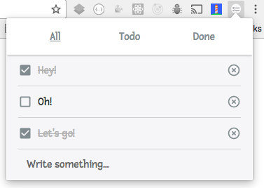

# TodoList for Chrome (extension)

> Your TodoList in a Chrome extension



This project is an experiment using:

* Chrome extensions (with Storage permissions)
* React for rendering the popup
* Redux for handling changes in a background script

## Install

````sh
# Clone the project
git clone https://github.com/antoinechalifour/TodoList-for-Chrome.git

# Install dependencies
yarn

# Build the project
yarn build

# Navigate to chrome://extensions,
# enable developer mode and
# drop the dist folder in the page
```